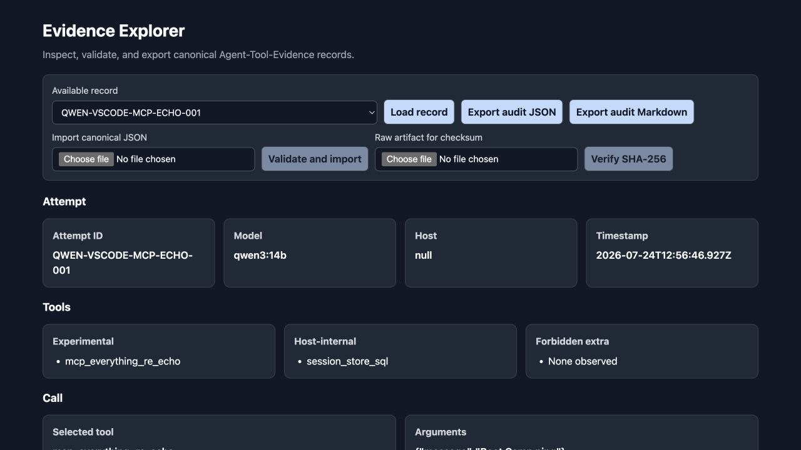

# Evidence Explorer

[](https://github.com/FREQUENCITY15/Evidence-Explorer/releases)
[](https://github.com/FREQUENCITY15/Evidence-Explorer/actions/workflows/tests.yml)
[](LICENSE)
[](https://www.python.org/)

Evidence Explorer is a local, deterministic viewer for canonical agent-tool
experiment records. It helps a reviewer answer four questions:

1. What did the model request?
2. What did the host execute?
3. Which conclusions are supported by exact evidence?
4. Did the attempt stay within the declared tool policy?



## Public-alpha notice

Version `0.8.0` is an early public alpha. It is suitable for evaluation,
experimentation, and local review—not as a sole production security control or
compliance decision.

The supported deployment boundary is a single user on loopback
(`127.0.0.1`). Authentication, authorization, tenancy, remote hosting, billing,
and hardened shared deployment are not included.

## What it does

- Loads canonical Agent-Tool-Evidence schema `1.0.0` records.
- Distinguishes malformed records from incomplete but useful evidence.
- Preserves meaningful `null`, `false`, and zero values.
- Shows six reliability verdict layers with stable JSON Pointer citations.
- Computes deterministic Govern states: green, amber, red, flagged, or
  unscored.
- Imports validated JSON records through an explicit append-only action.
- Renders line-numbered raw evidence using text-only DOM sinks.
- Verifies a selected raw artifact against `checksums.main_jsonl` with bounded,
  ephemeral SHA-256 hashing.
- Exports byte-stable JSON and readable Markdown audit artifacts.
- Requires no cloud service, API key, database, or model for evidence review.

Evidence Explorer is delivered inside the existing Project Mentor application.
Project Mentor's deterministic Map, Teach, and Debug workflows remain available
from the home page.

## Five-minute demo

### macOS or Linux

```bash
git clone https://github.com/FREQUENCITY15/Evidence-Explorer.git
cd Evidence-Explorer
python3 -m venv .venv
.venv/bin/python -m pip install --upgrade pip
.venv/bin/python -m pip install -r requirements.txt
.venv/bin/python -m uvicorn project_mentor.main:app --host 127.0.0.1 --port 8000
```

### Windows 11

```powershell
git clone https://github.com/FREQUENCITY15/Evidence-Explorer.git
cd Evidence-Explorer
.\setup_project.bat
.\start_project_mentor.bat
```

The Windows helper currently requires an installed Python 3.14 interpreter
(`py -3.14`). Python 3.12–3.14 is tested by GitHub Actions.

Open:

- Evidence Explorer sample:
  <http://127.0.0.1:8000/evidence/QWEN-VSCODE-MCP-ECHO-001>
- Project Mentor home: <http://127.0.0.1:8000/>
- API documentation: <http://127.0.0.1:8000/docs>

The bundled sample intentionally demonstrates an honest non-clean result:
tool-surface drift remains unscored, host-internal visibility remains visible,
and legacy verdicts without citations are marked unmoored.

## Review workflow

1. Open the bundled record or select another available record.
2. Check evidence completeness before relying on any verdict.
3. Read Govern separately from reliability. Attempt failure and policy
   violation are different questions.
4. Follow finding and verdict citations to exact raw JSON nodes.
5. Optionally import a canonical JSON object with **Validate and import**.
6. Optionally select corresponding raw bytes and choose **Verify SHA-256**.
7. Export JSON as the lossless audit source and Markdown as the readable copy.

For a repeatable 10–15 minute evaluation, follow the
[pilot audit walkthrough](docs/pilot-audit-bundle.md).

## Evidence storage

Records live in `evidence/sample/` by default. For evaluation, use a separate
writable directory:

```bash
mkdir -p /absolute/path/to/pilot-records
EVIDENCE_RECORDS_DIR=/absolute/path/to/pilot-records \
  .venv/bin/python -m uvicorn project_mentor.main:app --host 127.0.0.1 --port 8000
```

PowerShell:

```powershell
$env:EVIDENCE_RECORDS_DIR = "C:\EvidenceExplorer\pilot-records"
.\.venv\Scripts\python.exe -m uvicorn project_mentor.main:app --host 127.0.0.1 --port 8000
```

The directory must already exist. Only direct regular `.json` files are
accepted. Nested paths and symlinks are rejected. Imports use `attemptId` as a
flat filename and never replace an existing record.

## Evidence API

| Method | Endpoint | Purpose |
|---|---|---|
| `GET` | `/api/evidence/index` | List available flat record IDs. |
| `GET` | `/api/evidence/{id}` | Return the validated canonical record. |
| `GET` | `/api/evidence/{id}?include_validation=true` | Return the record plus validation and Govern results. |
| `POST` | `/api/evidence/import` | Validate and append one canonical record. |
| `POST` | `/api/evidence/{id}/verify-checksum` | Hash a bounded octet-stream and compare SHA-256. |
| `GET` | `/api/evidence/{id}/audit?export_format=json` | Download the lossless audit artifact. |
| `GET` | `/api/evidence/{id}/audit?export_format=markdown` | Download the readable audit artifact. |

Imports are limited to 1,000,000 serialized bytes. Raw checksum inputs are
limited to 10,000,000 bytes.

Checksum verification is deliberately ephemeral. Standard audit exports report
`checksumVerification: "not_performed"` because a transient browser result is
not durable verification evidence.

## Trust boundaries

- Evidence is read as data and is never executed or imported.
- Record identifiers are flat and bounded; traversal and symlinks are rejected.
- Schema validation rejects unsupported versions, invalid structural types,
  unknown verdict vocabulary, and fabricated or unresolved citations.
- Govern is a pure deterministic policy calculation and does not use an LLM.
- Unknown invoked tools default to forbidden rather than trusting self-reported
  classifications.
- Dynamic record content is inserted with `textContent`, never raw HTML.
- Imports validate before persistence and use exclusive creation.
- Raw checksum bytes are streamed, bounded, hashed, and discarded.
- Downloads and imports require explicit user actions.

See [SECURITY.md](SECURITY.md) for the supported security boundary and private
reporting process.

## Tests

```bash
.venv/bin/python -m unittest discover -s tests -v
```

The suite is offline and intentionally skips one live-Ollama smoke test unless
explicitly enabled. GitHub Actions runs the complete suite on Python 3.12,
3.13, and 3.14.

## Known limitations

- Evidence Explorer audits canonical records; it does not create experiments.
- Checksum verification is not a signed or durable attestation.
- There is no browser action to overwrite or delete evidence.
- There is no authentication, authorization, tenancy, or remote synchronization.
- Static Project Mentor analysis cannot prove Python runtime behaviour.
- The Starlette test client currently emits a non-failing dependency
  deprecation warning.

## Contributing

Bug reports, evidence-producer compatibility requests, and focused pull
requests are welcome. Use only synthetic or thoroughly sanitized examples.
Read [CONTRIBUTING.md](CONTRIBUTING.md) before submitting data or code.

## Licence

Copyright 2026 Thomas Finlayson.

Licensed under the [Apache License 2.0](LICENSE).
